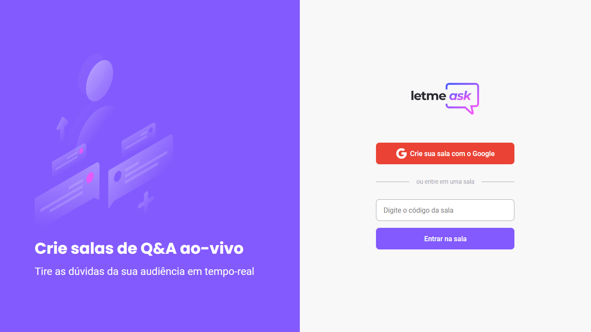

# Letmeask

  

## 💻 Projeto

Letmeask é um projeto construído durante a 6ª Next Level Week, da Rocketseat.

A aplicação consiste em um sistema onde o usuário pode criar salas e perguntas sobre determinado tema.

## 🚀 Tecnologias

Projeto desenvolvido com as seguintes tecnologias:

<ul>
  <li>ReactJS</li>
  <li>SCSS</li>
  <li>HTML</li>
</ul>

  
  

  
  

